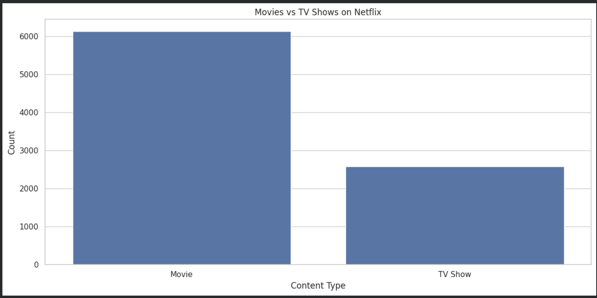
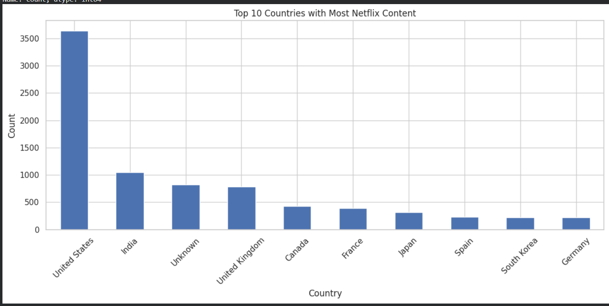
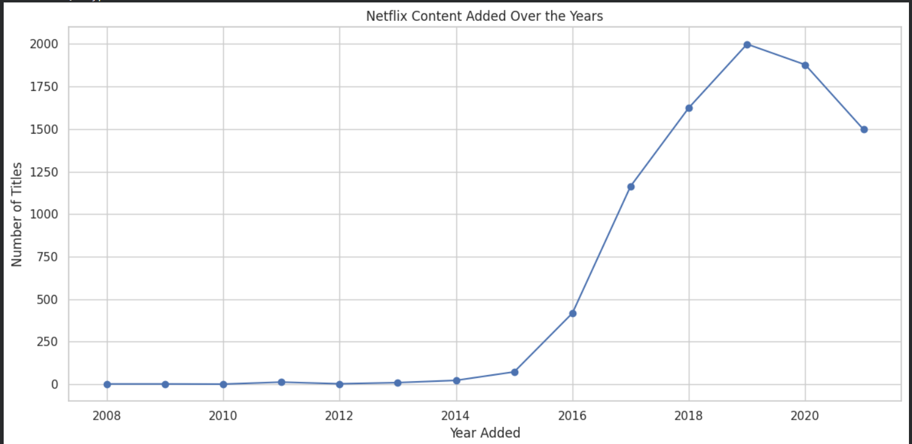
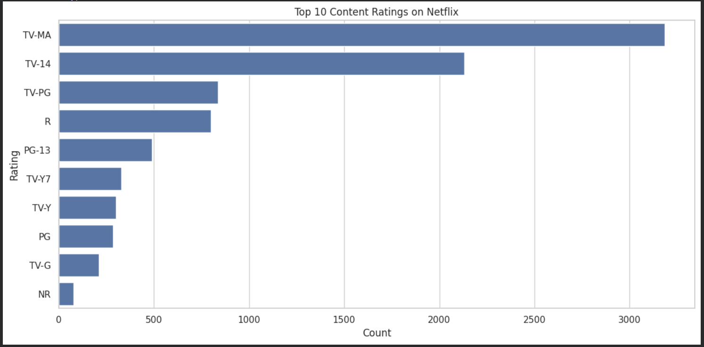
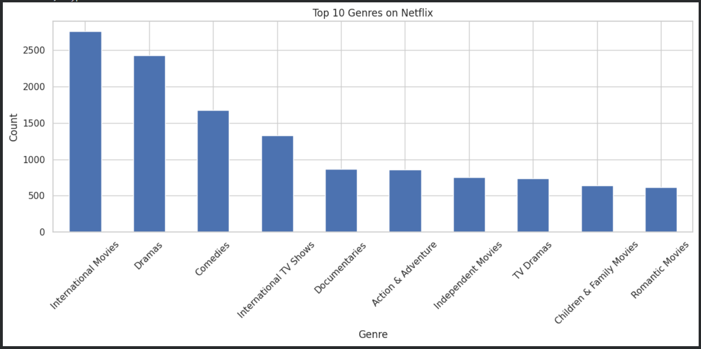
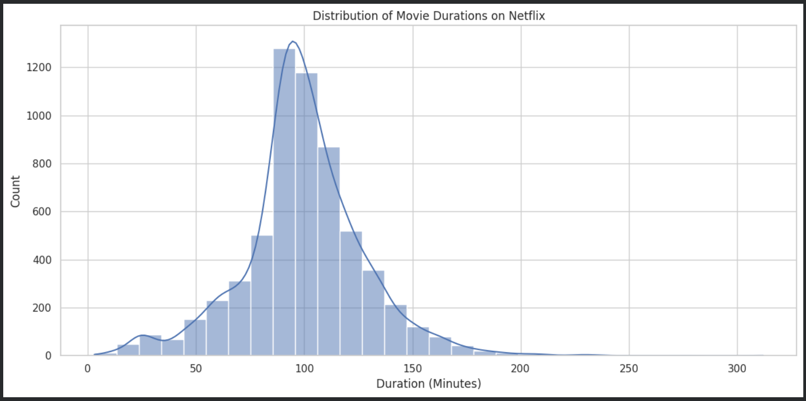
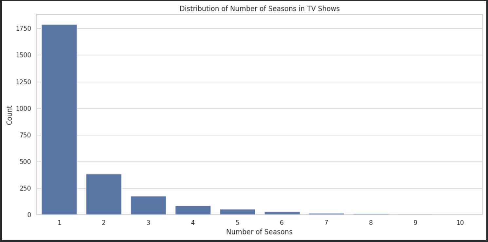

# Netflix Data Analysis

## Overview
This project explores and analyzes Netflix content data using Python.  
The main objective of this project is to perform **Exploratory Data Analysis (EDA)** on Netflix's dataset and identify useful patterns, trends, and business insights.

---

## Project Objective
The purpose of this project is to:
- Analyze Netflix's content library
- Compare Movies and TV Shows
- Identify top contributing countries
- Explore ratings, genres, and release trends
- Understand content growth over time

---

## Tools & Technologies Used
- **Python**
- **Pandas**
- **Matplotlib**
- **Seaborn**
- **Jupyter Notebook / Google Colab**

---

## Dataset Files
- `netflix_titles.csv` → Raw dataset
- `cleaned_netflix_titles.csv` → Cleaned dataset

---

## Project Workflow
The following steps were performed in this project:

1. **Data Loading**
   - Imported the Netflix dataset into Python

2. **Data Cleaning**
   - Handled missing values
   - Converted date columns into proper datetime format
   - Extracted year and month information

3. **Exploratory Data Analysis (EDA)**
   - Movies vs TV Shows analysis
   - Country-wise content analysis
   - Rating analysis
   - Genre analysis
   - Release year trend analysis
   - Duration and seasons analysis

4. **Data Visualization**
   - Created visual charts for better understanding of patterns

5. **Business Insights**
   - Derived useful conclusions from the data

---

## Key Insights
Some important insights found from this analysis:

- Netflix contains **more Movies than TV Shows**
- The **United States** contributes a major share of Netflix content
- Netflix's content library grew rapidly after recent years
- **Drama, International, and Comedy** are among the most common genres
- Most TV Shows on Netflix have **short season counts**
- Netflix content serves multiple audience groups through varied ratings

---

## Visual Outputs

### 1. Movies vs TV Shows

### 2. Top Countries with Most Content

### 3. Content Added Over the Years

### 4. Top Ratings

### 5. Top Genres

### 6. Movie Duration Distribution

### 7. TV Show Seasons Distribution

---

## Conclusion
This project demonstrates how Python can be used to clean, analyze, and visualize real-world data.  
It helped in understanding content trends on Netflix and improved practical skills in:
- Data Cleaning
- Exploratory Data Analysis
- Data Visualization
- Insight Extraction

---

## Learning Outcome
Through this project, I improved my understanding of:
- Working with real-world datasets
- Handling missing values
- Creating visualizations
- Interpreting data for meaningful insights

---

## Author
**Jhanvi Narayan**
